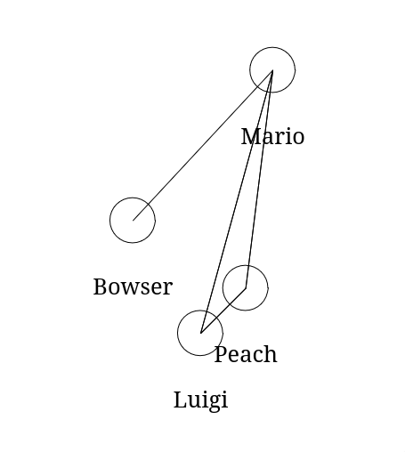

# Mapas

<p align="center">
    <b>Um módulo educacional para programação funcional</b>
    <a href="https://en.wikipedia.org/wiki/Seven_Bridges_of_K%C3%B6nigsberg">
        
    </a>
</p>


## Descrição

O módulo foi criado para suporte aos alunos da disciplina de Programação
Funcional na Universidade Federal de Sergipe (UFS).

O módulo define tipos como `Cidade`, `Estradas` e `Mapa`, assim como:

- funções de IO para os mapas, representados por arquivos com a extensão `.mapa`
- funções de desenho de cidades, estradas e mapas, usando `CodeWorld` como API
  para os desenhos

## Instalação

Por causa da dependência `codeworld-api`, é recomendado instalar via `cabal` (ou
`stack`, se preferir).

### `cabal`

A ferramenta `cabal` é o sistema de pacotes padrão de Haskell. É muito fácil se
perder ao usar ela, mas siga os passos que você vai se dar bem =).

1. Siga a [documentação](https://cabal.readthedocs.io/en/stable/) e
   instale, via GHCup, `cabal 3.10.1.0` ou maior.
2. Clone esse repositório fazendo `git clone
   https://github.com/Pedro-V/mapas-pf` (ou baixe o zip).
3. Edite o seu código em `src/Main.hs`. Não se esqueça de importar as
   bibliotecas necessárias.
4. Teste com `cabal repl` ou `cabal run` (isso pode demorar). Não use somente o `ghci`,
   pois não terá acesso aos módulos.

## Documentação da API pública

**API pública** é o conjunto de elementos que um módulo exporta: tipos,
funções, constantes, etc. Como a nossa é minúscula, ela é capaz de ser descrita no
README. **Lembre de incluir `import Mapa` no começo do seu código**.

### `Mapa`, `Cidade`, `Estradas` e outros tipos

- Esses tipos modelam um grafo, uma das estruturas mais
  utilizadas na computação, que representa cidades nomeadas (`Nome`) distribuídas no plano cartesiano
  (`Localizacao`), as quais possuem estradas para outras cidades (`Estradas`). A
  lista de cidades é um `Mapa`.
- Obs: Pode ocorrer dos tipos que você definiu anteriormente entrarem em
  conflito com os tipos exportados pelo módulo. Recomendo apagar seus tipos e
  usar os exportados pela API.
```hs
meuPais :: Cidade
meuPais = ("Aracaju", (8, 10), ["Maceió", "Recife", "Salvador"])

cidadeFrevo :: Cidade
cidadeFrevo = ("Recife", (8, 15), ["Aracaju"])

orlaFraca :: Cidade
orlaFraca = ("Maceió", (7, 12.5), ["Aracaju"])

nordesteParcial :: Mapa
nordesteParcial = [meuPais, cidadeFrevo, orlaFraca]

-- veja que Recife-Aracaju-Maceió formam uma rota
rota :: Estradas
rota = ["Recife", "Aracaju", "Maceió"]
```

### `carregarMapa :: FilePath -> IO Mapa`

- Carrega um `Mapa` de um arquivo `.mapa`
- Obs: **Importante usar o operador bind `<-` visto nas aulas de IO**
```hs
marioWorld :: Mapa
marioWorld <- carregarMapa "teste.mapa"
-- se nao usassemos operador bind, tipo resultante seria IO Mapa
```

### `salvarMapa :: FilePath -> Mapa -> IO ()`

- Salva um `Mapa` num dado arquivo.
```hs
novoMarioWorld = (adicionarCidade "Wario" -100.3 0.0 . removerCidade "Luigi") marioWorld
salvarMapa "teste.mapa" novoMarioWorld
```

### `desenharCidade :: Cidade -> Picture`

- Desenha uma cidade (no momento, uma simples bola) em sua `Localizacao` no plano
  cartesiano.

### `desenharEstrada :: Cidade -> Cidade -> Picture`

- Desenha uma linha reta entre duas cidades.

### `desenharMapa :: Mapa -> Picture`

- Desenha todas cidades e estradas do dado mapa

```hs
import CodeWorld
import Mapa

main :: IO ()
-- funcoes que geram Picture devem ser desenhadas com drawingOf
main = drawingOf $ desenharMapa marioWorld
  where
    marioWorld <- carregarMapa "teste.mapa"
```

<p align="center">
     <br/>
    Mario World
</p>
